# Rapport d'usage de l'IA - TP1

Pour chaque mission, détailler et fournir des explications concernant : objectif; prompt principal; plan proposé par l'agent; vérifications réalisées par le binôme; erreurs ou propositions rejetées; fichiers effectivement modifiés; preuve de fonctionnement; ce que chaque membre sait maintenant expliquer sans l'agent.

Modèle utilisé : Claude Sonnet 5 (`claude-sonnet-5`), via Claude Code.

Note : j'ai fait ce premier TD seul, pas encore en binôme.

## Mission 0 — Cartographie de l'application

**Objectif** : comprendre comment le projet frontend est organisé (composant racine, routes, HttpClient, services, mécanisme JWT) sans toucher au code, et produire un schéma du flux de connexion.

**Prompt principal** : c'est moi qui ai donné la direction à prendre : explorer `frontend-starter/src/` sans rien modifier, expliquer un par un les points demandés par le sujet, et me générer un schéma du flux de connexion directement en HTML plutôt que d'aller sur un site externe pour faire un diagramme — comme ça j'ai un fichier tout prêt à ouvrir, sans dépendre d'un outil en ligne.

**Plan proposé par l'agent** : lire les fichiers clés (`main.ts`, `app.ts`, `routes.ts`, les intercepteurs, les services, les pages) et comparer avec `API_CONTRACT.md`, puis rédiger les notes et le diagramme.

**Vérifications réalisées par moi** : le contenu de ces notes vient de ce que j'ai compris moi-même en explorant le projet. Le premier jet de rédaction ne me convenait pas, donc j'ai demandé à l'assistant de le reformuler dans un style plus simple et plus proche de comment je parle, pour que ce soit plus clair et plus facile à réviser pour moi — pas pour qu'il fasse le travail de compréhension à ma place. J'ai aussi ouvert le schéma HTML dans le navigateur pour vérifier qu'il s'affiche correctement.

**Erreurs ou propositions rejetées** : le premier jet de notes était trop formel à mon goût, j'ai demandé qu'il soit réécrit dans un langage plus simple.

**Fichiers effectivement modifiés** : aucun fichier de code (mission d'exploration uniquement, comme demandé). Fichiers créés : `TP1_MISSIONS.md`, `schema-flux-connexion.html`.

**Preuve de fonctionnement** : pas de code à tester pour cette mission ; le schéma HTML a été ouvert et s'affiche correctement.

**Ce que je sais maintenant expliquer sans l'agent** : le rôle du composant racine et du `router-outlet`, comment `authGuard` protège les routes, comment l'intercepteur ajoute automatiquement le JWT aux requêtes, où le token est stocké (localStorage + Signal), et la différence entre routes publiques et protégées côté API.

## Mission 1 — Inscription, connexion et profil

**Objectif** : compléter la partie utilisateur du frontend selon la checklist du sujet (formulaires, validations, JWT, déconnexion, profil, gestion du 401), en modifiant seulement ce qui manquait ou n'était pas optimal — le starter avait déjà une bonne partie de fait.

**Prompt principal** : j'ai donné la méthode à suivre : reprendre les points du sujet un par un dans l'ordre, vérifier l'état réel de chaque point dans le code plutôt que de supposer, ne modifier que ce qui était vraiment nécessaire, me montrer le code avant de l'appliquer, et documenter chaque changement dans `TP1_MISSIONS.md` avec mes mots pour que je puisse tout réexpliquer facilement.

**Plan proposé par l'agent** : passer les 10 points du sujet un à un (formulaires, validations, appels API, stockage JWT, Signal `currentUser`, redirections, bouton de déconnexion, chargement du profil, modification du profil, gestion du 401), vérifier ce qui existait déjà avant de coder, et attendre ma validation avant chaque modification de code.

**Vérifications réalisées par moi** : pour chaque modification proposée (validations du formulaire d'inscription, bouton de déconnexion, chargement auto du profil, intercepteur 401), j'ai lu le code avant/après et validé avant que ce soit appliqué. J'ai demandé de garder le bouton "Charger mon profil" en plus du chargement automatique plutôt que de le supprimer. J'ai aussi fait vérifier avec un `grep` que la contrainte "les composants n'appellent jamais HttpClient directement" était bien respectée partout. Les explications dans `TP1_MISSIONS.md` viennent de ce que j'ai compris en suivant chaque étape ; j'ai demandé une reformulation dans mon style à chaque fois que ce n'était pas assez clair pour moi.

**Erreurs ou propositions rejetées** : rien de rejeté sur le fond du code, mais j'ai ajusté un point : garder le bouton manuel de rechargement du profil au lieu de le supprimer, pour pouvoir recharger le profil à la main si besoin.

**Fichiers effectivement modifiés** : `register-page.ts` et `register-page.html` (validations du formulaire), `app.ts` et `app.html` (bouton de déconnexion), `profile-page.ts` (chargement automatique du profil), `main.ts` et le nouveau fichier `error.interceptor.ts` (gestion du 401).

**Preuve de fonctionnement** : compilation Angular réussie à chaque étape (logs `ng serve` vérifiés). Côté backend, tests via `curl` : inscription avec mot de passe trop court → 400, inscription valide → 201 avec token, login → token renvoyé, `GET /api/users/me` avec token valide → 200, avec token invalide → 401. Captures Network faites par moi dans le navigateur (le détail de chaque requête est dans la partie Checkpoint de `TP1_MISSIONS.md`) :

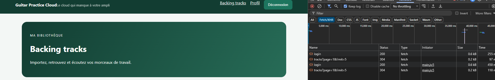

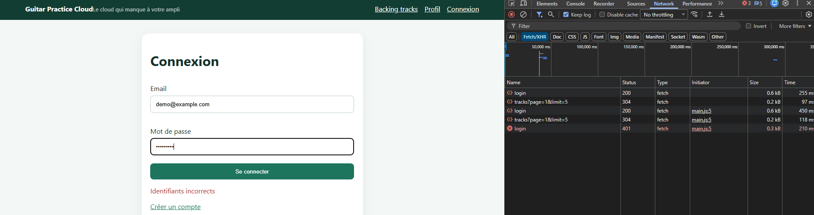

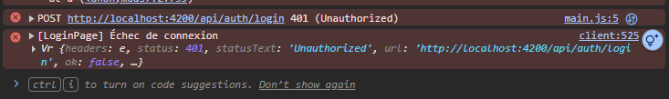

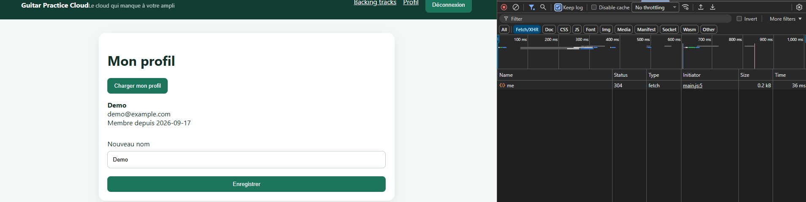

**Ce que je sais maintenant expliquer sans l'agent** : pourquoi les validations du formulaire côté front doivent correspondre aux règles du backend, comment fonctionne l'intercepteur qui ajoute le JWT à chaque requête, pourquoi il fallait un intercepteur séparé pour intercepter les réponses 401, où se trouve exactement la logique de mise à jour du profil côté back (`app.js`) et côté front (`auth.service.ts` / `profile-page.ts`), et pourquoi les composants ne doivent jamais appeler `HttpClient` directement.

# Rapport d'usage de l'IA - TP2

Modèle utilisé : Claude Opus 5.5 (`claude-opus-5-5`), via Claude Code.

Les explications détaillées de chaque mission sont dans `TP2_MISSIONS.md`.

## Mission 2 — Bibliothèque paginée

**Objectif** : avoir une bibliothèque paginée côté serveur, avec les Signals `tracks`, `page`, `pages`, `loading` et l'erreur, `@for` / `@empty` / `@if` dans le template, et des boutons Précédent / Suivant désactivés aux bornes, sans modifier le backend et sans découper la liste côté Angular.

**Prompt principal** : j'ai repris la même méthode qu'au TP1 : d'abord ranger mes fichiers audio de test au bon endroit, puis vérifier point par point ce que le starter faisait déjà pour la Mission 2, ne compléter que ce qui manquait, et tout documenter dans `TP2_MISSIONS.md` et ici en m'énonçant clairement chaque étape.

**Plan proposé par l'agent** : lire `track.service.ts`, `tracks-page.ts/html` et la route `GET /api/tracks` dans `app.js` pour voir comment le backend calcule `pages` ; ajouter le signal d'erreur manquant ; séparer l'affichage chargement / liste ; renommer et sécuriser les boutons de pagination ; tester la pagination sur le vrai backend.

**Vérifications réalisées par moi** : j'ai vérifié dans le backend que `pages` vaut toujours au moins 1 (donc pas de bug avec une bibliothèque vide, contrairement à ce qu'on soupçonnait au départ). J'ai relu les modifications du composant et du template avant de les garder. La pagination a été testée sur le backend lancé en local avec `page=1`, `2` et `3`, et les logs serveur montrent bien une requête différente à chaque page.

**Erreurs ou propositions rejetées** : l'hypothèse d'un bug du bouton Suivant avec une bibliothèque vide a été écartée après lecture du backend. Dans un premier temps, l'agent avait terminé la mission de base sans les options avancées ; je lui ai demandé de confirmer, il a reconnu qu'elles n'étaient pas faites et on les a planifiées puis réalisées dans un second temps (en mode plan). Pour le Paginator, j'ai choisi de remplacer nos boutons au lieu de garder les deux. J'ai aussi demandé de passer tout le TP2 sur une branche `tp2` au lieu de `main`. Pendant la mise en place du style Material, une première règle CSS aurait écrasé les styles de Material : elle a été corrigée avec `:where()`.

**Fichiers effectivement modifiés** : mission de base : `tracks-page.ts` (signal `error`, garde contre les doubles chargements), `tracks-page.html` (affichage de l'erreur, `@if/@else` pour le chargement). Option Mongoose : `backend/src/models/Track.js` (plugin), `backend/src/app.js` (route `GET /api/tracks` en aggregate), `backend/test/api.test.js`, `backend/package.json`, `API_CONTRACT.md`. Option Material : `frontend-starter/package.json`, `angular.json` (thème), `styles.css`, `main.ts`, nouveau `shared/i18n/paginator-intl.ts`, `shared/models/page.model.ts`, `tracks-page.ts/html/css` (`mat-paginator`, signaux `limit` et `total`, `onPage()`). Fichiers de test ajoutés : `coffee-time.mp3` et `summer-breeze.mp3` dans `frontend-starter/fichiers-audio-de-test/`. `track.service.ts` n'a pas eu besoin d'être modifié.

**Preuve de fonctionnement** : build Angular sans erreur ; logs backend `[tracks] Lecture page=1, limit=5`, puis `page=2`, puis `page=3` lors des tests. Captures faites par moi dans le navigateur avec 6 pistes sur le compte :

Pour les options avancées : `npm test` du backend passe (3 tests sur 3), et les appels `curl` sur la nouvelle route renvoient `total: 6`, `pages: 2`, `hasNextPage` / `hasPrevPage` corrects, sans `storedName` ni `_id`, et 401 sans token. Le build Angular avec Material passe sans erreur, et j'ai vérifié le rendu dans le navigateur :

**Ce que je sais maintenant expliquer sans l'agent** : la différence entre une pagination serveur (`skip`/`limit` + `countDocuments` dans Mongo) et un découpage côté client, pourquoi chaque clic sur Précédent / Suivant doit refaire une requête HTTP, comment les Signals pilotent l'affichage du template (`@if`, `@for`, `@empty`), et pourquoi on désactive les boutons pendant un chargement. Pour les options avancées : ce que fait un pipeline d'agrégation (`$match`, `$sort`, `$project`) et pourquoi il faut convertir l'id en `ObjectId` à la main, à quoi servent les `customLabels` du plugin pour ne pas casser le contrat, pourquoi le Paginator compte à partir de 0 alors que l'API commence à 1, et comment `MatPaginatorIntl` permet de traduire le composant.

## Mission 3 — Upload et lecture audio

**Objectif** : identifier où se passent le choix du fichier, le `FormData`, l'upload, le `Blob`, l'`ObjectURL`, le lecteur et la révocation ; expliquer l'intercepteur JWT et les contrôles du backend ; puis compléter seulement ce qui manquait côté frontend (validation avant envoi, états pendant l'upload, cards accessibles, morceau en cours, erreurs audio, révocation finale) et répondre aux questions sur la mémoire, le buffering et le streaming.

**Prompt principal** : je voulais que la Mission 3 soit faite comme la 2 : d'abord repérer dans le code ce qui existait déjà côté backend et frontend, ne rien refaire et ne pas toucher au contrat HTTP, compléter le front point par point avec un commit par fonctionnalité sur la branche `tp2`, et tout expliquer dans `TP2_MISSIONS.md` avec mes mots.

**Plan proposé par l'agent** : lire `app.js` (Multer, `allowed`, `MAX_FILE_SIZE`, routes upload / audio, gestionnaire d'erreurs), `track.service.ts`, `auth.interceptor.ts` et `tracks-page.*` ; créer un validateur partagé qui reprend les règles du backend ; ajouter les signaux de l'upload ; transformer la liste en cards avec des pipes de formatage ; compléter la lecture ; vérifier les points du checkpoint avec `curl` ; rédiger l'analyse et les réponses.

**Vérifications réalisées par moi** : j'ai relu les modifications et les explications. Les points du checkpoint ont été vérifiés côté serveur avec `curl` : un fichier texte renvoie 400 « Format audio non accepté », un envoi sans fichier renvoie 400 « Fichier audio requis », la lecture renvoie `200` en `audio/mpeg` avec `Accept-Ranges: bytes`, une demande `Range` renvoie `206 Partial Content`, sans token on a 401, et avec le token d'un deuxième compte de test la piste du compte demo renvoie 404. Le rendu dans le navigateur (cards, messages, lecteur) et les captures Network restent à faire par moi.

**Erreurs ou propositions rejetées** : une première version utilisait un seul signal d'erreur pour la validation et pour les erreurs serveur ; ça bloquait le bouton Envoyer après une erreur serveur, donc on a séparé `fileError` et `uploadError`. Mettre le token dans l'URL du `<audio>` a été écarté, parce qu'il finirait dans l'historique et dans les logs.

**Fichiers effectivement modifiés** : `tracks-page.ts`, `tracks-page.html`, `tracks-page.css`, `styles.css`, et les nouveaux fichiers `shared/validators/audio-file.ts`, `shared/pipes/file-size.pipe.ts` et `shared/pipes/audio-format.pipe.ts`. Aucun fichier backend ni `track.service.ts` n'a été modifié pour cette mission.

**Preuve de fonctionnement** : build Angular sans erreur et tests `curl` ci-dessus. Captures faites par moi dans le navigateur :

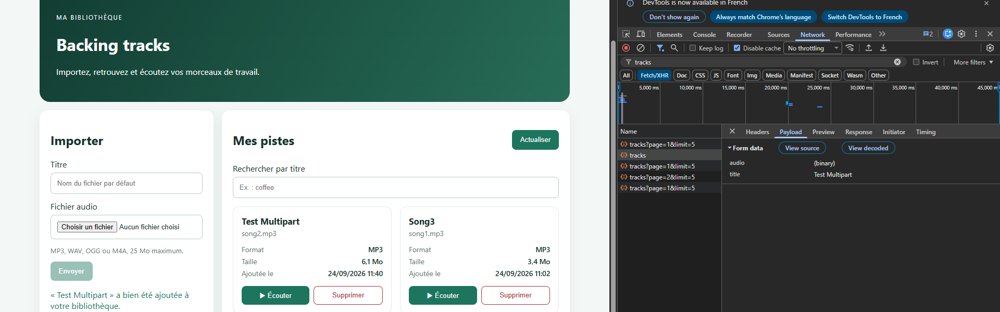

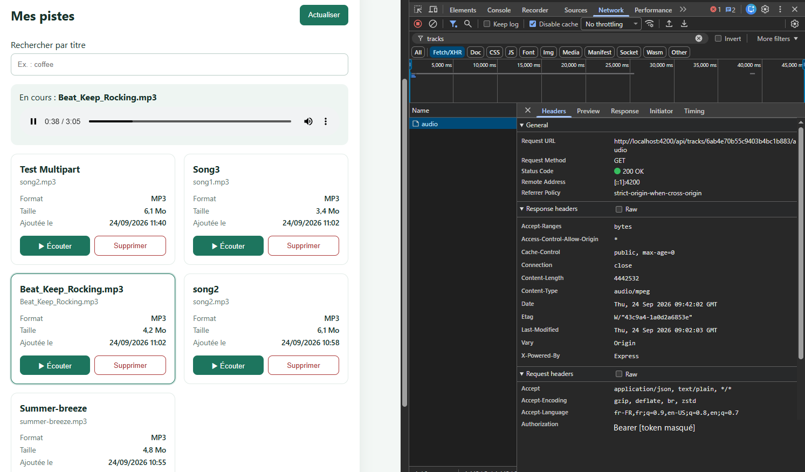

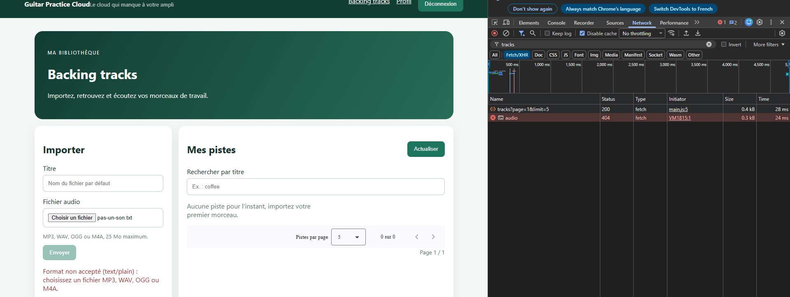

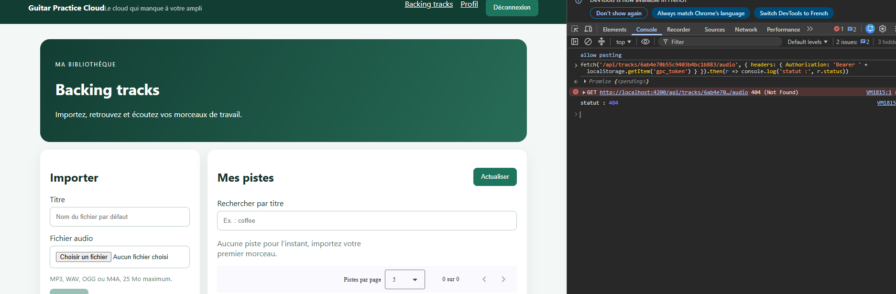

**Ce que je sais maintenant expliquer sans l'agent** : le trajet d'un fichier de l'input jusqu'au disque du serveur et à MongoDB, pourquoi un `src` direct n'envoie pas le JWT et comment `Blob` + `ObjectURL` contournent le problème, pourquoi la validation frontend ne remplace jamais celle du backend, la différence entre télécharger un Blob complet, le buffering du navigateur et le streaming côté serveur (requêtes `Range`, réponse 206), et pourquoi il faut révoquer une `ObjectURL` dans une SPA.

## Améliorations facultatives

**Objectif** : faire toutes les améliorations facultatives du sujet : barre de progression de l'upload, suppression avec confirmation, rafraîchissement après suppression, formatage lisible de la taille et de la date (déjà fait en Mission 3), et filtre par titre.

**Prompt principal** : j'ai demandé de faire toutes les améliorations facultatives, sans pousser directement, en me demandant mon avis sur les choix à faire et en m'expliquant chaque étape.

**Plan proposé par l'agent** : une amélioration par commit ; `reportProgress` + `observe: 'events'` pour la progression ; la route `DELETE` qui existait déjà, avec une dialog de confirmation ; un paramètre `?q=` côté serveur pour le filtre ; tests `curl` à chaque étape.

**Vérifications réalisées par moi** : l'agent m'a posé deux questions et c'est moi qui ai choisi : une dialog Angular Material plutôt que `window.confirm()`, et un filtre côté serveur (`?q=`) plutôt qu'un filtre sur la page affichée, pour garder une vraie pagination serveur. Tests `curl` : suppression 204 puis 404, liste mise à jour ; filtre insensible aux majuscules, caractères spéciaux échappés (`.*` ne renvoie rien, `(` ne fait pas planter le serveur), `q` envoyé en double ignoré ; `npm test` du backend passe. Le rendu dans le navigateur reste à vérifier par moi.

**Erreurs ou propositions rejetées** : le filtre sur la page affichée seulement a été écarté, parce qu'il ne trouve pas les pistes des autres pages et qu'il ressemble au découpage local interdit par le sujet. `window.confirm()` a été écarté au profit de la dialog Material.

**Fichiers effectivement modifiés** : `track.service.ts` (`upload` avec les événements de progression, `remove`, `list` avec `q`), `tracks-page.ts/html/css`, le nouveau `shared/components/confirm-dialog/confirm-dialog.ts`, `backend/src/app.js` (paramètre `q` sur `GET /api/tracks`) et `API_CONTRACT.md`.

**Preuve de fonctionnement** : build Angular sans erreur, tests backend 3/3, et tests `curl` ci-dessus. Captures faites par moi :

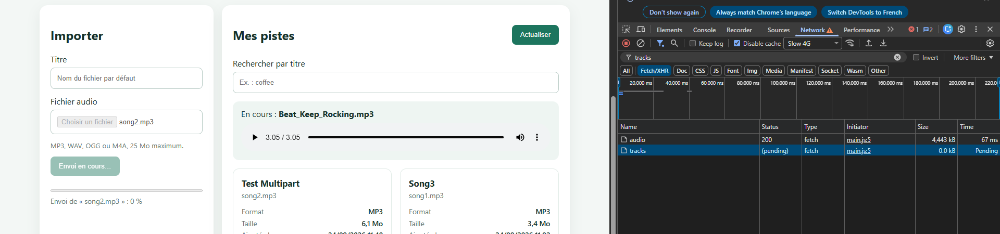

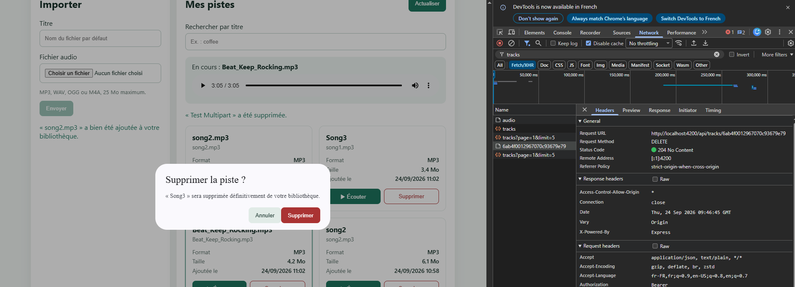

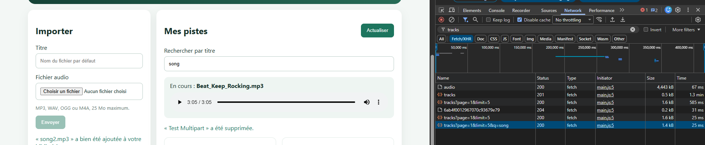

**Ce que je sais maintenant expliquer sans l'agent** : comment `reportProgress` et `HttpEventType` permettent de suivre un upload, comment une `MatDialog` renvoie un résultat avec `afterClosed()`, pourquoi un filtre doit être fait côté serveur quand la liste est paginée, pourquoi il faut échapper une saisie avant d'en faire une regex MongoDB, et à quoi servent `debounceTime`, `distinctUntilChanged` et l'annulation de la requête précédente.

## AVANCÉ — Image de couverture

**Objectif** : ajouter une image de couverture à chaque morceau, en identifiant d'abord les modifications de données et d'API, et en respectant la sécurité, l'accessibilité et les droits sur les images.

**Prompt principal** : j'ai demandé de faire l'image de couverture en me laissant choisir l'approche, puis de passer en mode plan pour me présenter les modifications de données et d'API avant de coder, comme le demande le sujet.

**Plan proposé par l'agent** : deux champs dans `Track` (`coverName` masqué, `coverType`) et un booléen public `hasCover` ; deux nouvelles routes `PUT` et `GET /api/tracks/:id/cover` sans toucher à `POST /api/tracks` ; une deuxième configuration Multer (JPEG, PNG, WebP, 2 Mo, pas de SVG) avec vérification des premiers octets ; côté front, un champ facultatif dans le formulaire, un bouton sur chaque card et l'affichage en Blob + ObjectURL avec révocation.

**Vérifications réalisées par moi** : c'est moi qui ai choisi l'upload d'image plutôt que les tags ID3 et un service web. J'ai validé le plan (données et API) avant qu'il soit codé. Tests `curl` : vraie image 200, lecture en `image/png` avec `nosniff`, faux PNG 400, image trop grosse 400, SVG 400, sans fichier 400, sans token 401, compte demo 404 ; aucun fichier orphelin dans `data/uploads` après un refus, un remplacement ou une suppression. `npm test` : 4 tests sur 4. Build Angular sans erreur. Le rendu dans le navigateur reste à vérifier par moi.

**Erreurs ou propositions rejetées** : l'approche ID3 + service web a été écartée (dépendance externe, droits des images, et mes fichiers n'ont pas de pochette). Pendant le développement, un premier calcul de `hasCover` basé sur `coverName` aurait été faux dans certaines réponses, puisque ce champ n'est pas chargé par défaut ; il est maintenant calculé à partir de `coverType`.

**Fichiers effectivement modifiés** : `backend/src/models/Track.js`, `backend/src/app.js`, `backend/test/api.test.js`, `API_CONTRACT.md`, `track.model.ts`, `track.service.ts`, le nouveau `shared/validators/image-file.ts`, `tracks-page.ts/html/css`.

**Preuve de fonctionnement** : tests `curl` et `npm test` ci-dessus. Captures à ajouter.

**Ce que je sais maintenant expliquer sans l'agent** : pourquoi on identifie les changements de données et d'API avant de coder, pourquoi le type MIME envoyé par le client ne suffit pas et comment on vérifie la signature d'un fichier, pourquoi le SVG est dangereux, pourquoi une image protégée par JWT se charge comme l'audio (Blob + ObjectURL), et comment éviter les fichiers orphelins sur le serveur.
