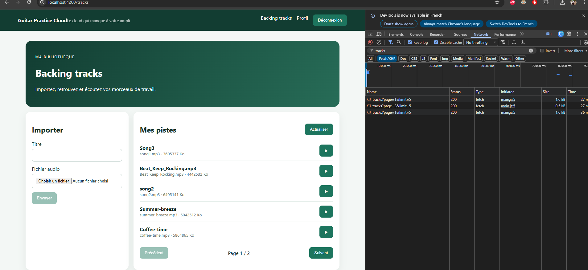
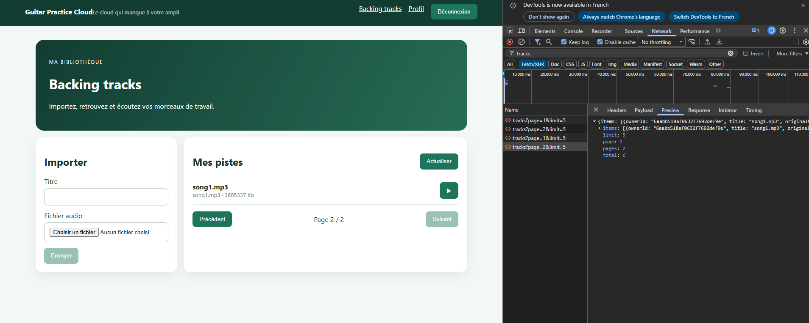
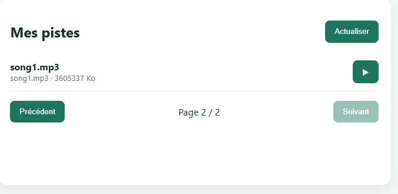
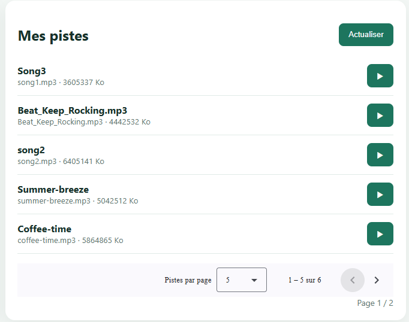

# TP2 — Mes missions

## Préparation

Avant de commencer j'ai récupéré deux mp3 libres de droits en plus de song1 et song2 qui étaient déjà dans le starter. Je les ai rangés dans frontend-starter/fichiers-audio-de-test avec des noms simples (coffee-time.mp3 et summer-breeze.mp3), comme ça j'ai quatre fichiers sous les 25 Mo pour tester l'upload et avoir assez de pistes pour voir plusieurs pages.

## Mission 2 — Bibliothèque paginée

Le but c'est que la page tracks affiche les pistes page par page, et surtout que chaque changement de page refasse une vraie requête au backend. Interdit de tout récupérer d'un coup et de découper la liste côté Angular. Et on touche pas au backend.

Ce qui était déjà là

Comme au TP1 j'ai d'abord regardé ce que le starter faisait déjà. TrackService.list(page, limit) envoie bien page et limit en query params avec HttpClient, donc le flux composant → TrackService → HttpClient → GET /api/tracks?page=...&limit=... existait déjà. Le composant avait aussi les signals tracks, page, pages et loading, un @for avec @empty pour la liste vide, et des boutons pour changer de page.

J'ai aussi été voir dans app.js comment le backend calcule la pagination. Il fait un skip((page - 1) * limit) et un limit(limit) sur la requête Mongo, en parallèle d'un countDocuments pour avoir le total, et il renvoie pages = au moins 1. Du coup même avec une bibliothèque vide on a "Page 1 / 1", pas de bug de ce côté là.

Le signal d'erreur

C'était le seul signal demandé qui manquait. Avant, si le chargement plantait, l'erreur partait juste dans la console et l'utilisateur voyait rien. J'ai ajouté un signal error, je le vide au début de chaque chargement et je le remplis avec le message du backend (ou un message par défaut) si la requête échoue. Il s'affiche en rouge au dessus de la liste avec role="alert" pour que ce soit lu par un lecteur d'écran.

L'affichage pendant le chargement

Avant, le "Chargement…" s'affichait en même temps que la liste, donc on pouvait voir "Aucune piste" et "Chargement…" en même temps au premier affichage, c'était pas très propre. Maintenant c'est un @if (loading()) avec un @else, donc soit on voit le chargement, soit on voit la liste (ou "Aucune piste" grâce au @empty).

Les boutons Précédent et Suivant

Je les ai renommés "Précédent" et "Suivant" comme dans le sujet (avant c'était "Préc." et "Suiv."). Ils sont désactivés aux bornes, Précédent sur la page 1 et Suivant sur la dernière page, et aussi pendant un chargement pour éviter qu'on spamme les clics et qu'on lance plusieurs requêtes en même temps. Dans go() j'ai rajouté une vérif en plus : si la page demandée est en dehors de 1 à pages, ou si ça charge déjà, on fait rien. Comme ça même si on appelle go() autrement que par le bouton, on peut pas sortir des bornes.

Le limit explicite

Le composant appelait list(this.page()) en laissant limit par défaut à 5 dans le service. Ça marchait mais c'était caché, donc j'ai mis une constante limit = 5 dans le composant et je l'envoie explicitement, comme ça on voit direct dans le composant combien de pistes par page on demande.

Comment j'ai vérifié

Le build Angular passe sans erreur. J'ai lancé le backend et appelé GET /api/tracks avec page=1, 2 et 3. Dans les logs du backend on voit bien "Lecture page=1", "page=2", "page=3" à chaque fois, donc c'est bien le serveur qui découpe et pas Angular. Pour la capture Network il faut plus de 5 pistes sur le compte pour avoir au moins deux pages, sinon le bouton Suivant reste grisé.

Les preuves

J'ai uploadé 6 pistes pour avoir 2 pages, puis j'ai fait les captures avec le Network ouvert, filtré sur tracks et cache désactivé.

Sur la première on voit les trois requêtes à la suite quand je fais recharger, Suivant puis Précédent : page=1, page=2, page=1, toutes en 200. Ça prouve qu'Angular refait une requête à chaque clic au lieu de découper la liste lui-même.

Sur la deuxième je suis sur la page 2, et dans le Preview de la requête on voit ce que le serveur renvoie : une seule piste dans items, page 2, pages 2 et total 6.

Et la dernière montre l'interface sur la page 2 : "Page 2 / 2", Précédent actif et Suivant grisé parce que c'est la dernière page.

Ces captures c'est la version de base avec mes propres boutons, avant que je fasse les deux options avancées juste en dessous.

## Mission 2 — AVANCÉ — Pagination Mongoose

Là c'est la seule partie du TP2 où le sujet autorise à toucher au backend. Le but c'est de remplacer la pagination faite à la main par le plugin mongoose-aggregate-paginate-v2.

Avant, la route GET /api/tracks faisait deux requêtes en parallèle avec Promise.all : un find() avec skip et limit pour récupérer les pistes de la page, et un countDocuments() pour avoir le total. Ensuite elle calculait pages elle-même avec Math.ceil(total / limit).

Maintenant j'ai installé le plugin, je l'ai branché sur le schéma Track avec schema.plugin(aggregatePaginate), et dans la route je construis un pipeline d'agrégation en trois étapes : un $match pour ne garder que les pistes de l'utilisateur connecté, un $sort pour avoir les plus récentes en premier, et un $project pour virer storedName (le nom du fichier sur le disque, qu'on doit jamais envoyer au front). Ensuite Track.aggregatePaginate() s'occupe tout seul du skip, du limit et du comptage.

Un piège que j'ai vu en passant : dans un aggregate, Mongoose convertit pas automatiquement l'id en ObjectId comme il le fait avec find(). Du coup si on met juste req.auth.sub (qui est une string) dans le $match, ça trouve rien. Faut faire new mongoose.Types.ObjectId(req.auth.sub).

Le plugin renvoie de base des champs qui s'appellent docs, totalDocs et totalPages. Avec l'option customLabels je les ai renommés en items, total et pages, comme ça le format de base du contrat reste le même et le front casse pas. Par contre il renvoie en plus des infos bonus : hasPrevPage, hasNextPage, prevPage, nextPage et pagingCounter (le numéro de la première piste de la page). Du coup j'ai mis à jour API_CONTRACT.md pour documenter tout ça, et le modèle Page côté Angular.

Pour vérifier j'ai ajouté un petit test dans api.test.js qui regarde que Track.aggregatePaginate existe bien, les 3 tests passent. Et j'ai appelé la route avec le compte demo qui a 6 pistes : page 1 donne 5 pistes avec hasNextPage à true, page 2 donne 1 piste avec nextPage à null, avec limit=10 on a les 6 d'un coup sur une seule page, sans token c'est toujours 401, et aucun storedName ni _id dans les réponses.

## Mission 2 — AVANCÉ — Angular Material

Le deuxième bonus c'était d'utiliser le composant Paginator d'Angular Material au lieu de mes boutons Précédent / Suivant faits main. J'ai choisi de remplacer mes boutons plutôt que de garder les deux, sinon ça fait doublon à l'écran.

J'ai installé @angular/material et @angular/cdk en version 22 pour que ça colle avec notre Angular 22. J'ai pas utilisé ng add parce que ça modifie plein de fichiers tout seul, j'ai préféré ajouter moi même le thème prédéfini azure-blue dans angular.json. Dans styles.css j'ai remis le vert du site comme couleur principale du paginator, et j'ai annulé le style global des boutons (fond vert, texte blanc) juste pour les boutons du paginator, sinon ses flèches avaient un gros fond vert. J'ai mis ça dans un :where() pour que ma règle soit pas plus forte que les styles de Material eux-mêmes.

Dans le composant, limit est devenu un signal parce que maintenant l'utilisateur peut choisir 5, 10 ou 20 pistes par page (20 c'est le max accepté par le backend). J'ai ajouté un signal total, parce que le paginator a besoin du nombre total de pistes pour calculer lui-même le nombre de pages. La fonction go() a été remplacée par onPage() qui reçoit l'événement du paginator. Petit truc à savoir : le paginator compte les pages à partir de 0 (pageIndex) alors que notre API commence à 1, donc je fais pageIndex + 1.

Le paginator est désactivé pendant un chargement, et ses flèches sont grisées toutes seules aux bornes, donc on garde bien ce que demandait la mission de base. J'ai aussi gardé un petit "Page X / Y" en dessous pour que le signal pages soit toujours visible.

Par défaut les textes du paginator sont en anglais ("Items per page", "1 – 5 of 6"). J'ai créé une classe FrenchPaginatorIntl dans shared/i18n qui hérite de MatPaginatorIntl pour tout mettre en français ("Pistes par page", "1 – 5 sur 6", "Page suivante"...), et je l'ai fournie dans main.ts, comme ça ça s'applique à tous les paginators de l'appli.

Chaque clic sur une flèche ou changement du nombre par page refait toujours une vraie requête au serveur avec page et limit, c'est toujours le backend qui découpe.

Voilà le rendu final avec le paginator en français, sur la page 1 avec 6 pistes : la flèche précédente est grisée et on voit bien "1 – 5 sur 6".

